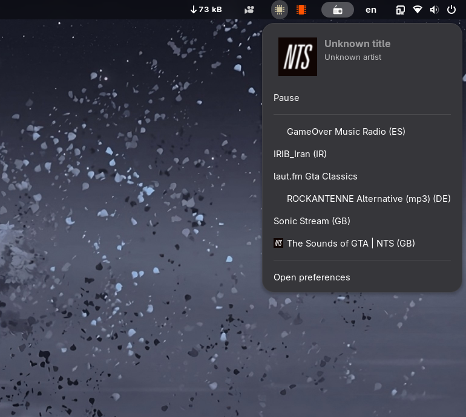
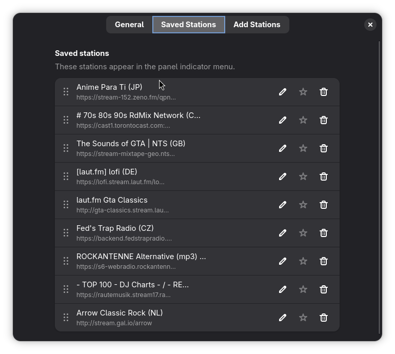
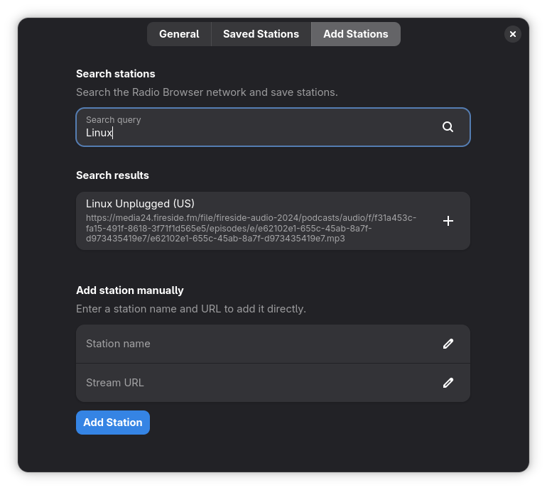

# Yet Another Radio
> Heavily inspired by [Advanced Radio Player Applet](https://store.kde.org/p/2136933/)

A GNOME Shell extension for listening to internet radio stations directly from your panel.

This extension uses [Radio Browser](https://www.radio-browser.info/)'s API to fetch radio urls and play them using gstreamer (Usually being installed with GNOME).

## Screenshots

## Features

- Play internet radio stations from the panel menu
- Search thousands of stations via Radio Browser network
- Mark favorites for quick access
- Add custom stations manually
- Import/Export station lists
- View track metadata, album art, and bitrate
- Play/pause controls

## Installation

Install it via [Gnome Extensions website](https://extensions.gnome.org/extension/8843/yet-another-radio/),

Or Copy the extension directory to `~/.local/share/gnome-shell/extensions/` and enable it via GNOME Extensions.

## Translating

If you would like to help translate Yet Another Radio into your language, see the detailed instructions in [TRANSLATING.md](TRANSLATING.md).

## License

This project is licensed under the GNU General Public License v3.0 or later (GPL-3.0+).
See the LICENSE file for more details.
